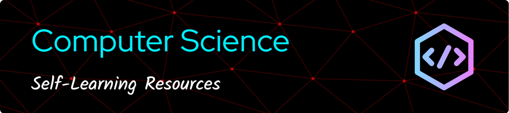

# CS Resources

> [!IMPORTANT]
> 大改版中：[xxrjun.github.io/cs-resources/](https://xxrjun.github.io/cs-resources/)

Changelog

[2024/04/16] 開始大改版並使用 [Material for MkDocs](https://squidfunk.github.io/mkdocs-material/)

Schedule

[2024/07/15] 預計套入 i18n 語言包

[2024/07/05] 預計導入一頁式功能

[2024/06/31] 預計完成繁中版本 v1.0

> 作為自己學習 Computer Science 的紀錄與未來規劃，為自己在這茫茫碼海中留下一點痕跡

> 期許自己的血液裡都流著程式碼的那天

## Table of Contents

- [CS Resources](#cs-resources)
  - [Table of Contents](#table-of-contents)
  - [開發工具 Developer Tools](#開發工具-developer-tools)
    - [Git - 免費、開源的版本控制軟體](#git---免費開源的版本控制軟體)
    - [IDE and Text Editor](#ide-and-text-editor)
    - [其他工具 Other Tools](#其他工具-other-tools)
  - [程式語言學習 (Programming Language)](#程式語言學習-programming-language)
    - [Java](#java)
    - [C++](#c)
    - [Python](#python)
    - [Golang](#golang)
    - [Rust](#rust)
  - [知識 Knowledge](#知識-knowledge)
    - [計算機概論 Introduction to Computer Science](#計算機概論-introduction-to-computer-science)
    - [資料結構 Data Structure](#資料結構-data-structure)
    - [演算法 Algorithm](#演算法-algorithm)
    - [計算機網路 Computer Networking](#計算機網路-computer-networking)
    - [作業系統 Operating System](#作業系統-operating-system)
    - [資料科學 Data Science](#資料科學-data-science)
  - [網頁開發 Web Development](#網頁開發-web-development)
    - [初來乍到 Beginner](#初來乍到-beginner)
    - [後端開發 Backend Development](#後端開發-backend-development)
  - [量子 Quantum](#量子-quantum)
  - [AI \& Machine Learning](#ai--machine-learning)
  - [考資工所](#考資工所)
  - [面試 Interview](#面試-interview)
  - [平台與社群媒體 (Platform \& Socia Media)](#平台與社群媒體-platform--socia-media)
    - [GitHub](#github)
    - [Youtube Channels](#youtube-channels)
    - [Podcast](#podcast)

包含中文及英文資源

## 開發工具 Developer Tools

> 工欲善其事，必先利其器。
>
> The mechanic, who wishes to do his work well, must first sharpen his tools.

下方軟體許多都可以透過  **[GitHub Student Developer Pack](https://education.github.com/pack)** 免費取得授權或升級至專業版，善用當學生的資源阿阿。

### [Git](https://gitforwindows.org/) - 免費、開源的版本控制軟體

- [GitHub](https://github.com/) - 目前全球最大的 Git Server、原始碼代管服務平台，各種開源軟體的聚集地。同時也是工程師的社群平台。題外話，2020 年之前的程式碼都存在北極，有 bug 也刪不掉。

  - [ProGit Book](https://git-scm.com/book/en/v2) - 官方提供的完整文件，部分語言翻譯不全，故推薦看英文。

  - [Will 保哥: 30 天精通 Git 版本控管](https://github.com/doggy8088/Learn-Git-in-30-days)

- [SourceTree](https://www.sourcetreeapp.com/) - 一款提供 GUI 界面來管理版本控制內容的軟體，功能完整。

- [GitHub Desktop](https://desktop.github.com/) - 也是提供圖形化介面的軟體，適合新手入門操作，不過功能有限。

### IDE and Text Editor

- [VSCode](https://code.visualstudio.com/) - 強大又免費的文字編輯器，可以安裝許多，支援許多語言環境，還可以安裝許多方便好用的套件。

  - [VSCode Docs](https://code.visualstudio.com/docs) - 微軟官方文件教學

- [Intellij IDEA](https://www.jetbrains.com/idea/) - 專為 Java 而生的 IDE，適合專案開發。有付費版 (Ultimate) 也有免費版 (Community)。
  - [JetBrains](https://www.jetbrains.com/) - Intellij IDEA 的開發商，提供許多 IDE，包含 Java、Python、C++、Golang、Rust 等等，都有專業版與免費版，免費版功能也很完整。

### 其他工具 Other Tools

- [Windows Terminal](https://www.microsoft.com/zh-tw/p/windows-terminal/9n0dx20hk701)

- [ChatGPT](https://openai.com/blog/chatgpt) (_Plus is highly recommended_)

  - [Prompt Engineering Guide 提示工程指南](https://promptingguide.azurewebsites.net/) - 2023 顯學?

- [GitHub Copilot](https://github.com/features/copilot)

<a href="#banner">BACK TO TOP</a>

## 程式語言學習 (Programming Language)

> 長期而言，技術來來去去，語言也來來去去，精通一種技術或語言，並不能保證你長期的發展。
>
> 你的目標不必侷限在學習甚麼語言或框架，只要吃透基礎知識，你可以學會任何你想要的東西。

### Java

- [Learn Java](https://dev.java/learn/) - 官方教學

- [Java Design Pattern](https://java-design-patterns.com/patterns/)

- [Codecademy Learn Java](https://www.codecademy.com/learn/learn-java) - Java 基礎，Lesson 部分免費，其他 Quiz、Projects 的部分要付費。

- [OpenHome Java](https://openhome.cc/zh-tw/java/) - 林信良老師(良葛格)撰寫的 Java 中文教材。我們永遠記得您的偉大...

  - [OpenHome Gossip 語言技術：Java Essence](https://openhome.cc/Gossip/JavaEssence/) - 林信良老師(良葛格)撰寫的 Java 本質部分，「千萬別急著飛翔，卻忘了如何起步」

### C++

- [Microsoft 歡迎回到 C++ (現代 C++)](https://learn.microsoft.com/zh-tw/cpp/cpp/welcome-back-to-cpp-modern-cpp?view=msvc-170&viewFallbackFrom=vs-2019) - 微軟官方 C++ 中文文件。

- [OpenHome 語言技術：C++ Gossip](https://openhome.cc/Gossip/CppGossip/index.html) - 林信良老師(良葛格)撰寫的 C++ 中文教材

- [Standard C++ Library reference (cplusplus)](https://cplusplus.com/reference/) - 英文標準函式庫文件

- [CS106L Standard C++ Programming - Stanfard](https://web.stanford.edu/class/cs106l/)

  - [Fall 2019 Youtube Playlist](https://www.youtube.com/playlist?list=PLCgD3ws8aVdolCexlz8f3U-RROA0s5jWA) - Youtube 課程播放清單

  - [Winter 2018 Course Website](https://web.stanford.edu/class/archive/cs/cs106l/cs106l.1184/index.html) - 課程網站，有 slides 跟 assignments

### Python

- [The Python Tutorial](https://docs.python.org/3/tutorial/index.html) - Python 官方文件教程，有多種語言可以選擇。

- [CS 61A: Structure and Interpretation of Computer Programs - UC Berkely](https://inst.eecs.berkeley.edu/~cs61a/fa20/) - 前半部以 Python 為主，後面包含 Scheme, SQL。本課程強調抽象，學習掌握程序來解決實際問題。

### Golang

- [The Little Go Book](http://openmymind.net/The-Little-Go-Book/)

### Rust

- [Rust 程式設計語言](https://rust-lang.tw/book-tw/) - 由 Steve Klabnik 與 Carol Nichols，以及 Rust 社群的貢獻撰寫而成。由台灣社群翻譯。

- [Learn Rust With Entirely Too Many Linked Lists](https://rust-unofficial.github.io/too-many-lists/index.html) - 透過許多 Linked Lists 學習 Rust。內容寫得很完整。

- [CS110L: Safety in Systems Programming Spring 2020](https://reberhardt.com/cs110l/spring-2020/) - Stanford 大學比較進階的課程，透過這門課學習 Rust 語言。

<a href="#banner">BACK TO TOP</a>

## 知識 Knowledge

> 站在巨人的肩膀上成為下一個巨人

### 計算機概論 Introduction to Computer Science

- [CS50](https://www.edx.org/course/introduction-computer-science-harvardx-cs50x) - Harvard 大學知名課程

- [Computer Science](https://www.youtube.com/watch?v=tpIctyqH29Q&list=PL8dPuuaLjXtNlUrzyH5r6jN9ulIgZBpdo) - youtube 上介紹機算機科學的一系列影片，不少還挺有趣的

### 資料結構 Data Structure

- [UC Berkeley CS61B Spring 2021](https://sp21.datastructur.es/) - UC Berkeley 資料結構課程，使用的程式語言是 Java，作業也很有趣，個人相當喜歡。選擇年份時記得看一下該學期的 autograder 是否有開放以利檢測自己作業的正確性。

### 演算法 Algorithm

- [NYCU Algorithms](https://ocw.nycu.edu.tw/?post_type=course_page&p=62057)

- [2019 Fall 台大資工 演算法設計與分析 NTU CSIE ADA](https://www.csie.ntu.edu.tw/~yvchen/f107-ada/)

### 計算機網路 Computer Networking

- [NTHUOCW 計算機網路](https://www.youtube.com/watch?v=8HoeJ3JleQg&list=PLS0SUwlYe8cwqVK1W3cs5zrdChpWA1ooB) - 由清大黃能富教授所上的計算機網路課程

- [Computer Networking: A Top-Down Approach 8th](http://gaia.cs.umass.edu/kurose_ross/lectures.php) - 由 JimKurose 撰寫的線上教材

### 作業系統 Operating System

- [11010 清大周志遠教授 作業系統](https://ocw.nthu.edu.tw/ocw/index.php?page=course&cid=295&)
  - [11010 Youtube Playlist](https://youtube.com/playlist?list=PLS0SUwlYe8cxj8FCPRoPHAehIiN9Vo6VZ)

### 資料科學 Data Science

- [Data8: The Foundations of Data Science](http://data8.org/) - UC Berkeley 資料科學導論課程

  - [Data 8 Fall 2021 Course](http://data8.org/fa21/)

  - [Computational and Inferential Thinking: The Foundations of Data Science](https://inferentialthinking.com/chapters/intro.html) - 上課用教材

- [donnemartin/system-design-primer](https://github.com/donnemartin/system-design-primer) - GitHub 上熱門的系統設計教材。

- [System Design by Gaurav Sen](https://www.youtube.com/playlist?list=PLMCXHnjXnTnvo6alSjVkgxV-VH6EPyvoX)

- [System Design Interview Prep by Exponent](https://youtube.com/playlist?list=PLrtCHHeadkHp92TyPt1Fj452_VGLipJnL) - Youtube Playlist，許多 System Design 的模擬面試

<a href="#banner">BACK TO TOP</a>

## 網頁開發 Web Development

> 工具一直再變動，但核心基礎知識不太會一直更迭
>
> 要時時刻刻提醒自己不要盲目追求新工具，先學會走路才能飛得更遠

> 培養查閱官方文件的能力很重要，往往第二手教學資訊都需要等比較久

### 初來乍到 Beginner

- [MDN](https://developer.mozilla.org/zh-TW/) - 網頁開發開源文件與學習資源

- [Cloudfare 學習中心](https://www.cloudflare.com/zh-tw/learning/) - 有關網路安全和 Cloudflare 在網際網路上如何運作的相關學習資源

- [University of Helsinki - Full Stack open 2022](https://fullstackopen.com/en/) - 開放式全端教學，React、Testing、Server、GraphQL、TypeScript、CI/CD ...等等許多 Web 開發的知識都都錄在裡面

- [2022 網頁開發全攻略(HTML, CSS, JavaScript, React, SQL, Node, more)](https://www.udemy.com/course/html5-css3-z/) - Udemy 付費課程，初學者網頁開發中文教學，內容很豐富，推!

### 後端開發 Backend Development

#### 後端知識 Backend Knowledge

- [成為看起來很強的後端 - Web 實驗室](https://www.youtube.com/playlist?list=PLS5AiLcCHgNxd341NwuY9EOpVvY5Z8VOs) - 用很短的時間就可以了解到後端藍圖，老師講的非常前顯易懂，受益良多。

<a href="#banner">BACK TO TOP</a>

## 量子 Quantum

> 新世界

- [krishnakumarsekar/awesome-quantum-machine-learning](https://github.com/krishnakumarsekar/awesome-quantum-machine-learning)

- [15-859BB: Quantum Computation and Quantum Information 2018](https://www.cs.cmu.edu/~odonnell/quantum18/)

- [IBM Quantum](https://quantum-computing.ibm.com/)

## AI & Machine Learning

- [Mozilla AI Guide](https://ai-guide.future.mozilla.org/)

- [Hung-yi Lee Course List](https://speech.ee.ntu.edu.tw/~tlkagk/courses.html)

- [陳縕儂 Vivian NTU MiuLab Youtube](https://www.youtube.com/@VivianMiuLab)

## 考資工所

- [資工所資源](https://eecsmt.com/cs-resource/) - 善心人士整理的原文書、筆記、歷屆試題

- [歷屆試題 (Google Drive)](https://drive.google.com/drive/folders/1S1n1htLt0nkMatIyDZLqpRuP7l9tj5X3)

- [十週考上台清交資工所的那些小事](https://hackmd.io/@kangchunhung/things_of_getting_admitted_by_CSIE_Department#%E5%8D%81%E9%80%B1%E8%80%83%E4%B8%8A%E5%8F%B0%E6%B8%85%E4%BA%A4%E8%B3%87%E5%B7%A5%E6%89%80%E7%9A%84%E9%82%A3%E4%BA%9B%E5%B0%8F%E4%BA%8B) - 好文推薦

<a href="#banner">BACK TO TOP</a>

## 面試 Interview

- [LeetCode](https://leetcode.com/problemset/all/) - 刷題工具

- [Coding Interview University](https://github.com/jwasham/coding-interview-university) - Github 上自學教程，一個非本科生花八個月自學從網頁前端到成為 Amazon 軟體工程師

<a href="#banner">BACK TO TOP</a>

## 平台與社群媒體 (Platform & Socia Media)

### GitHub

- [**科技爱好者周刊**](https://github.com/ruanyf/weekly)

  記錄每周值得分享的科技內容，每周五發布。很多很有趣的科技新聞跟酷酷的東西!

- [**HelloGitHub**](https://github.com/521xueweihan/HelloGitHub)

  GitHub 上有趣、入門級的開源項目。

### Youtube Channels

- [Joma Tech](https://www.youtube.com/c/JomaOppa) - 最喜歡的工程師頻道之一，許多有關在矽谷以及在科技巨頭的生活，還有很多有趣的影片。特別推薦 Interview 的影片清單。

- [HackBear 泰瑞](https://www.youtube.com/c/HackBear%E6%B3%B0%E7%91%9E) - 北美巨巨軟體工程師，非本科出身，分享許多軟體界以及投資的知識與故事。

- [CodeSheep 程序羊](https://www.youtube.com/channel/UC9PZ_j30JhfgjOrJZAtYzRw/videos) - 中國軟體工程師，分享不少學習軟體工程的想法與心法。

- [SchelleyYuki](https://www.youtube.com/c/SchelleyYuki/featured) - 滿滿乾貨...

- [在地上滾的工程師 Nic](https://www.youtube.com/c/NicLin/videos) - 用薪資打臉學歷才能成為好工程師的男人。沒有頂尖的學歷，但絕對有豐富的經歷。

- [freeCodeCamp.org](https://www.youtube.com/c/Freecodecamp) - 大量免費且豐富完整的課程。主旨為 "Learn to code for free". 真的是佛來的。

- [Traversy Media](https://www.youtube.com/c/TraversyMedia/featured) - 海量前端學習課程。從基礎 HTMl, CSS & JavaScript 到前端框架如 React, Vue 在到後端像 Node.js, Python 和 PHP

- [Fireship](https://www.youtube.com/c/Fireship/featured) - 每周更新技術科技相關的大小事，影片時長都不長，非常適合閒暇時刻學習新知或認識新技術。

### Podcast

- [矽谷輕鬆談 Just Kidding Tech](https://linktr.ee/jktech) - 在矽谷工作的一對很可愛的夫妻錄製的 Podcast，內容包含產業趨勢觀察、軟體開發、職涯發展、美國科技公司的新聞和八卦。

- [程人頻道](https://linktr.ee/chengrenpindao3) - 許多第一線科技產業的訪談以及思維想法分享。

<a href="#banner">BACK TO TOP</a>

